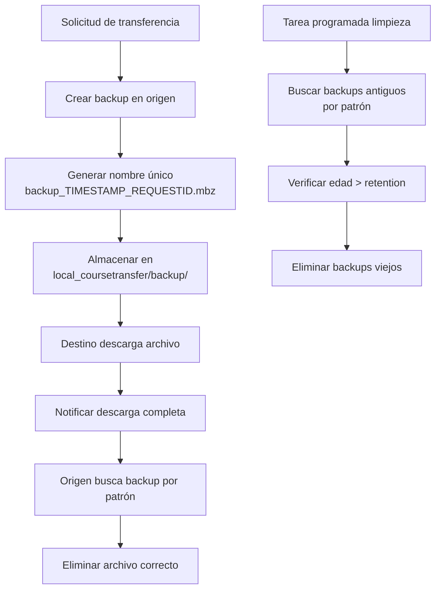

# 🔐 Nombres Únicos de Archivos de Backup con Timestamp

## 📋 Descripción de la Mejora

Se ha implementado un sistema de nombres únicos para los archivos de backup que previene colisiones cuando el mismo curso se respalda múltiples veces.

### ❌ Problema Anterior

**Nombre fijo:** `backup.mbz`

Cuando se solicitaba el backup del mismo curso varias veces (por ejemplo, porque se realizaron cambios y se quiere transferir nuevamente):

1. ❌ El segundo backup intentaba crear un archivo con el mismo `pathnamehash`
2. ❌ Error de clave duplicada en `mdl_files`
3. ❌ Transferencia fallida

```sql
ERROR: Duplicate entry '6c245edf0c48a3295043700588ee10b8a66cb6c5' 
       for key 'mdl_file_pat_uix' in mdl_files
```

### ✅ Solución Implementada

**Nombre único:** `backup_{timestamp}_{requestid}.mbz`

Cada backup genera un nombre único que incluye:
- **timestamp**: Marca de tiempo UNIX (garantiza unicidad temporal)
- **requestid**: ID de la solicitud de transferencia (garantiza unicidad por request)

**Ejemplo:**
```
backup_1730498550_123.mbz
backup_1730502340_124.mbz
backup_1730502399_123.mbz  ← Mismo curso (requestid diferente)
```

## 🔧 Archivos Modificados

### 1. **`classes/coursetransfer.php`**
**Método:** `create_backupfile_url()`

**Antes:**
```php
'filename' => 'backup.mbz',
```

**Después:**
```php
// Use unique filename with timestamp to avoid collisions
$unique_filename = 'backup_' . $timestamp . '_' . $requestoriginid . '.mbz';

$filerecord = [
    'filename' => $unique_filename,
    // ... resto de campos
];
```

### 2. **`classes/external/backend/target_course_callback_external.php`**
**Método:** `target_backup_downloaded()`

**Cambio:** Ahora busca archivos usando patrón regex en lugar de nombre fijo

**Antes:**
```php
$file = $fs->get_file($context->id, 'local_coursetransfer', 
                      'backup', $requestid, '/', 'backup.mbz');
```

**Después:**
```php
$files = $fs->get_area_files($context->id, 'local_coursetransfer', 
                             'backup', $requestid, 'timemodified DESC', false);

foreach ($files as $file) {
    $filename = $file->get_filename();
    // Match pattern: backup_{timestamp}_{requestid}.mbz
    if (preg_match('/^backup_\d+_' . $requestid . '\.mbz$/', $filename)) {
        $file->delete();
        break;
    }
}
```

### 3. **`classes/task/cleanup_old_backup_files_task.php`**
**Método:** `cleanup_origin_backups()`

**Cambio:** Busca archivos por patrón para limpiar backups antiguos

**Antes:**
```php
$file = $fs->get_file($context->id, 'local_coursetransfer', 
                      'backup', $request->id, '/', 'backup.mbz');
```

**Después:**
```php
$files = $fs->get_area_files($context->id, 'local_coursetransfer', 
                             'backup', $request->id, 'timemodified DESC', false);

foreach ($files as $file) {
    $filename = $file->get_filename();
    if (preg_match('/^backup_\d+_' . $request->id . '\.mbz$/', $filename)) {
        if ($file->get_timemodified() < $cutoff_time) {
            $file->delete();
        }
    }
}
```

### 4. **Tests Actualizados**
- ✅ `tests/coursetransfer_restore_course_test.php`
- ✅ `tests/coursetransfer_restore_course_merge_test.php`

Los tests ahora buscan archivos usando el patrón regex en lugar del nombre fijo.

## 🎯 Beneficios

### 1. **Prevención de Colisiones**
✅ Cada backup tiene un nombre único
✅ No hay conflictos en `mdl_files`
✅ Múltiples backups del mismo curso pueden coexistir

### 2. **Trazabilidad Mejorada**
✅ El timestamp indica cuándo se creó el backup
✅ El requestid vincula el backup con la transferencia específica
✅ Facilita debugging y auditoría

### 3. **Compatibilidad con Usos Múltiples**
✅ Permite transferir el mismo curso varias veces
✅ Útil cuando se hacen cambios iterativos
✅ Soporte para respaldos incrementales futuros

### 4. **Limpieza Precisa**
✅ El sistema de limpieza automática sigue funcionando
✅ Puede identificar y eliminar el archivo correcto por patrón
✅ No afecta otros backups del mismo curso

## 🔄 Flujo Completo



## 📊 Ejemplo de Uso

### Escenario: Transferir mismo curso 2 veces

**Primera transferencia:**
```
Request ID: 123
Timestamp: 1730498550
Archivo: backup_1730498550_123.mbz
Estado: ✅ Completada, archivo limpiado
```

**Segunda transferencia (curso actualizado):**
```
Request ID: 124
Timestamp: 1730502340
Archivo: backup_1730502340_124.mbz
Estado: ✅ Completada sin colisiones
```

### Comparación de Pathnamehash

**Antes (nombre fijo):**
```
backup.mbz (context=398, itemid=123) → pathnamehash: 6c245edf...
backup.mbz (context=398, itemid=124) → pathnamehash: 6c245edf... ❌ DUPLICADO!
```

**Después (nombre único):**
```
backup_1730498550_123.mbz → pathnamehash: 7a3b4c8d... ✅
backup_1730502340_124.mbz → pathnamehash: 9f2e1a5c... ✅ ÚNICO!
```

## 🧪 Testing

### Test Manual

```php
// Request ID: 123, Timestamp: 1730498550
$filename = 'backup_1730498550_123.mbz';

// Patrón de búsqueda
$pattern = '/^backup_\d+_123\.mbz$/';

// Validar
preg_match($pattern, $filename); // ✅ Match!
```

### Tests Unitarios

Los archivos de test fueron actualizados para:
1. Buscar archivos por patrón regex
2. Verificar que el archivo existe con el formato correcto
3. Validar limpieza automática

## 🔍 Debugging

Si necesitas encontrar un backup específico:

```sql
-- Buscar por request ID
SELECT * FROM mdl_files 
WHERE component = 'local_coursetransfer' 
  AND filearea = 'backup'
  AND itemid = 123
  AND filename LIKE 'backup_%_123.mbz';

-- Ver todos los backups con timestamps
SELECT itemid, filename, filesize, 
       FROM_UNIXTIME(timecreated) as created_at,
       FROM_UNIXTIME(timemodified) as modified_at
FROM mdl_files 
WHERE component = 'local_coursetransfer' 
  AND filearea = 'backup'
  AND filename LIKE 'backup_%.mbz'
ORDER BY timecreated DESC;
```

## ⚠️ Notas de Migración

### Backups Existentes (formato antiguo)

Los backups creados antes de esta actualización con nombre `backup.mbz` seguirán funcionando:

1. ✅ La limpieza automática NO los afectará (no coinciden con el patrón)
2. ⚠️ Si existen, podrían causar colisiones en futuras transferencias
3. 🧹 Se recomienda limpiarlos manualmente o esperar a que caduquen

### Script de Limpieza (Opcional)

```sql
-- Ver backups en formato antiguo
SELECT * FROM mdl_files 
WHERE component = 'local_coursetransfer' 
  AND filearea = 'backup'
  AND filename = 'backup.mbz';

-- Eliminarlos manualmente si es necesario
-- (Usar con precaución, solo si no hay transferencias en curso)
```

## 📈 Versión

**Implementado en:** v1.3.1 (Noviembre 2024)
**Requiere:** v1.3.0 o superior (Sistema de logging)

## 🔗 Referencias

- [IMPLEMENTACION_LIMPIEZA_BACKUPS.md](./IMPLEMENTACION_LIMPIEZA_BACKUPS.md) - Sistema de limpieza automática
- [LOGGING_SYSTEM_README.md](./LOGGING_SYSTEM_README.md) - Sistema de logging detallado
- [Error Analysis](../ANALISIS_BACKUP_COMPLETO_COURSETRANSFER.md) - Análisis del error de colisión

---

**✅ Cambio implementado y validado**  
**📅 Fecha:** 1 de Noviembre, 2025  
**👤 Implementado por:** Sistema de mejoras CourseTransfer
